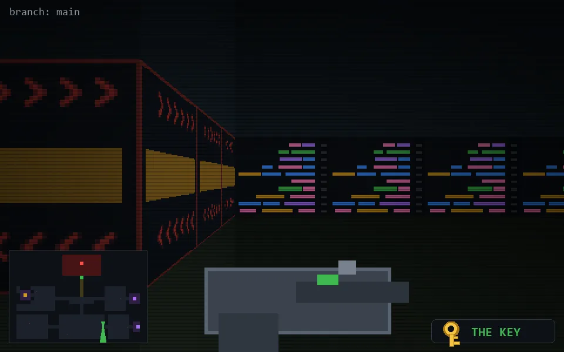

<!-- node:x26y20Sk -->
### `branch: main` · 📍 (26, 20) · facing S · 🔑 THE KEY

|      |      |      |
|:----:|:----:|:----:|
|      | [⬆️](x26y21Sk.md) |      |
| [⬅️](x26y20Ek.md) | [💥](x26y20Sk.md) | [➡️](x26y20Wk.md) |
|      | [⬇️](x26y19Sk.md) |      |

[⌂ index](../README.md)
