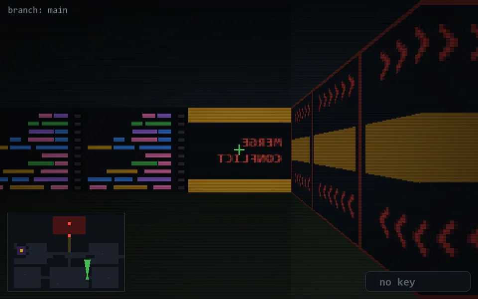

<!-- node:x26y21Nd -->
### `branch: main` · 📍 (26, 21) · facing N · 🔑 — · ✖ bug deleted (it will be back)

|      |      |      |
|:----:|:----:|:----:|
|      | [⬆️](x26y20Nd.md) |      |
| [⬅️](x26y21Wd.md) | [💥](x26y21Nd.md) | [➡️](x26y21Ed.md) |
|      | [⬇️](x26y22Nd.md) |      |

[⌂ index](../README.md)
