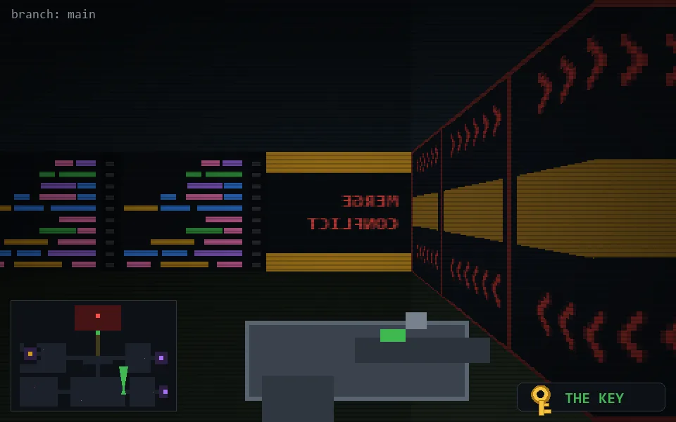

<!-- node:x26y21Nk -->
### `branch: main` · 📍 (26, 21) · facing N · 🔑 THE KEY

|      |      |      |
|:----:|:----:|:----:|
|      | [⬆️](x26y20Nk.md) |      |
| [⬅️](x26y21Wk.md) | [💥](x26y21Nkd.md) | [➡️](x26y21Ek.md) |
|      | [⬇️](x26y22Nk.md) |      |

[⌂ index](../README.md)
