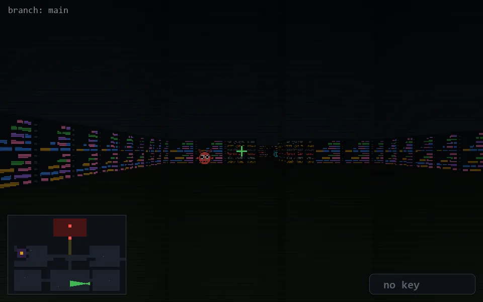

<!-- node:x26y22W -->
### `branch: main` · 📍 (26, 22) · facing W · 🔑 —

|      |      |      |
|:----:|:----:|:----:|
|      | [⬆️](x25y22W.md) |      |
| [⬅️](x26y22S.md) | [💥](x26y22Wd.md) | [➡️](x26y22N.md) |
|      | ⛔️ |      |

[⌂ index](../README.md)
