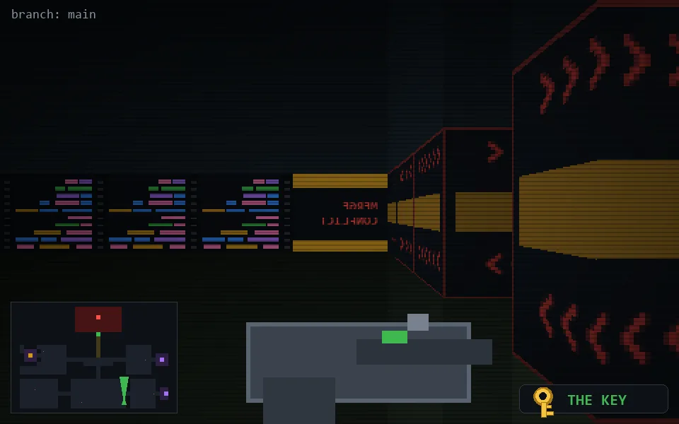

<!-- node:x26y23Nk -->
### `branch: main` · 📍 (26, 23) · facing N · 🔑 THE KEY

|      |      |      |
|:----:|:----:|:----:|
|      | [⬆️](x26y22Nk.md) |      |
| [⬅️](x26y23Wk.md) | [💥](x26y23Nkd.md) | [➡️](x26y23Ek.md) |
|      | [⬇️](x26y24Nk.md) |      |

[⌂ index](../README.md)
