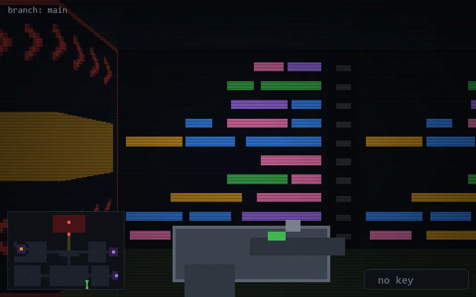

<!-- node:x26y23S -->
### `branch: main` · 📍 (26, 23) · facing S · 🔑 —

|      |      |      |
|:----:|:----:|:----:|
|      | [⬆️](x26y24S.md) |      |
| [⬅️](x26y23E.md) | [💥](x26y23S.md) | [➡️](x26y23W.md) |
|      | [⬇️](x26y22S.md) |      |

[⌂ index](../README.md)
