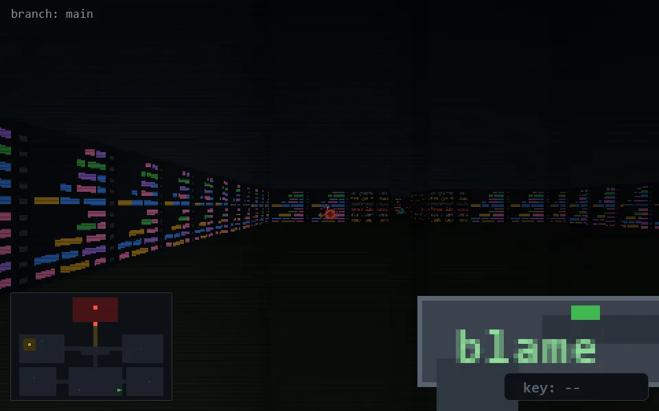

<!-- node:x26y23W -->
### `branch: main` · 📍 (26, 23) · facing W · 🔑 —

|      |      |      |
|:----:|:----:|:----:|
|      | [⬆️](x25y23W.md) |      |
| [⬅️](x26y23S.md) | [💥](x26y23W.md) | [➡️](x26y23N.md) |
|      | ⛔️ |      |

[⌂ index](../README.md)
