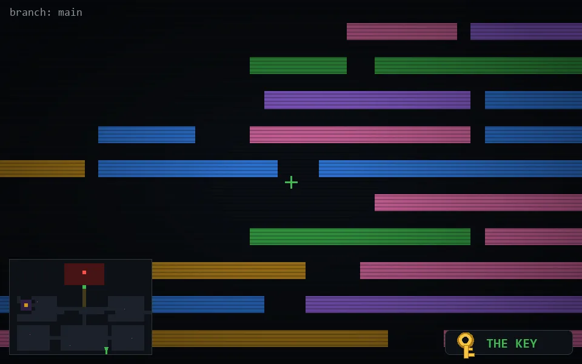

<!-- node:x26y24Sk -->
### `branch: main` · 📍 (26, 24) · facing S · 🔑 LGTM

|      |      |      |
|:----:|:----:|:----:|
|      | ⛔️ |      |
| [⬅️](x26y24Ek.md) | [💥](x26y24Sk.md) | [➡️](x26y24Wk.md) |
|      | [⬇️](x26y23Sk.md) |      |

[⌂ index](../README.md)
