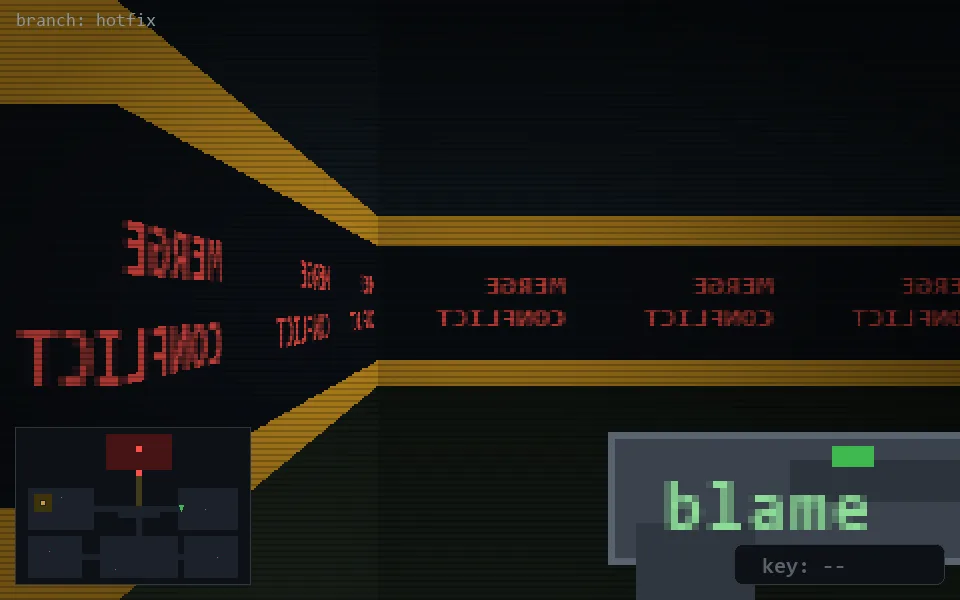

<!-- node:x27y13N -->
### `branch: hotfix` · 📍 (27, 13) · facing N · 🔑 —

|      |      |      |
|:----:|:----:|:----:|
|      | [⬆️](x27y12N.md) |      |
| [⬅️](x27y13W.md) | [💥](x27y13N.md) | [➡️](x27y13E.md) |
|      | ⛔️ |      |

[⌂ index](../README.md)
