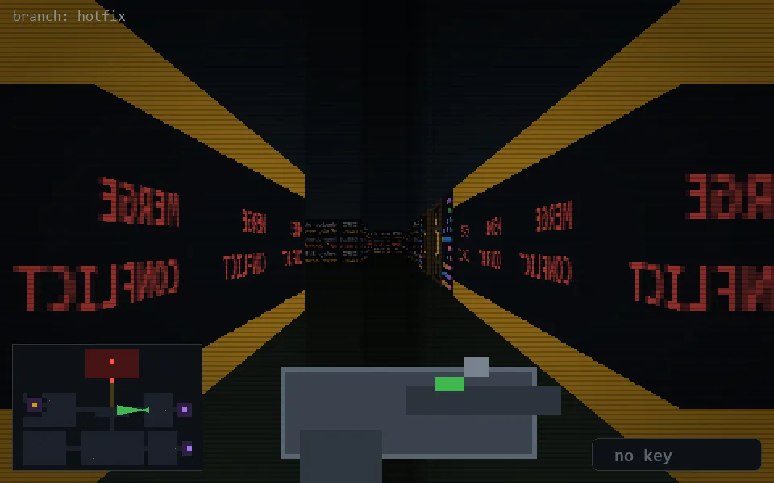

<!-- node:x27y13W -->
### `branch: hotfix` · 📍 (27, 13) · facing W · 🔑 —

|      |      |      |
|:----:|:----:|:----:|
|      | [⬆️](x26y13W.md) |      |
| [⬅️](x27y13S.md) | [💥](x27y13W.md) | [➡️](x27y13N.md) |
|      | [⬇️](x28y13W.md) |      |

[⌂ index](../README.md)
