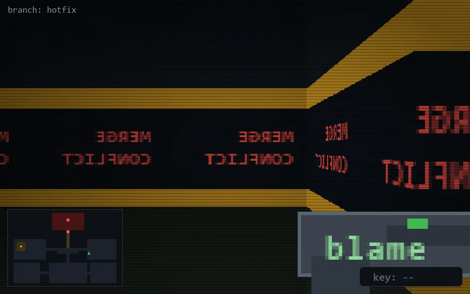

<!-- node:x27y14S -->
### `branch: hotfix` · 📍 (27, 14) · facing S · 🔑 —

|      |      |      |
|:----:|:----:|:----:|
|      | [⬆️](x27y15S.md) |      |
| [⬅️](x27y14E.md) | [💥](x27y14S.md) | [➡️](x27y14W.md) |
|      | [⬇️](x27y13S.md) |      |

[⌂ index](../README.md)
