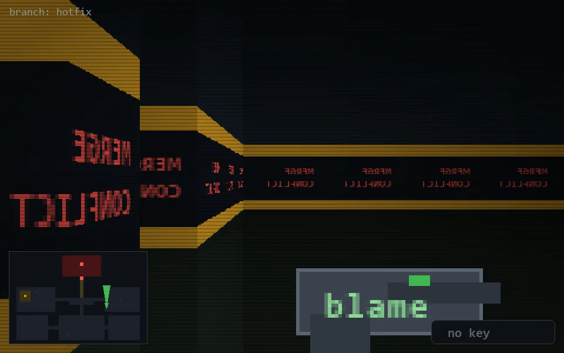

<!-- node:x27y15N -->
### `branch: hotfix` · 📍 (27, 15) · facing N · 🔑 —

|      |      |      |
|:----:|:----:|:----:|
|      | [⬆️](x27y14N.md) |      |
| [⬅️](x27y15W.md) | [💥](x27y15N.md) | [➡️](x27y15E.md) |
|      | [⬇️](x27y16N.md) |      |

[⌂ index](../README.md)
