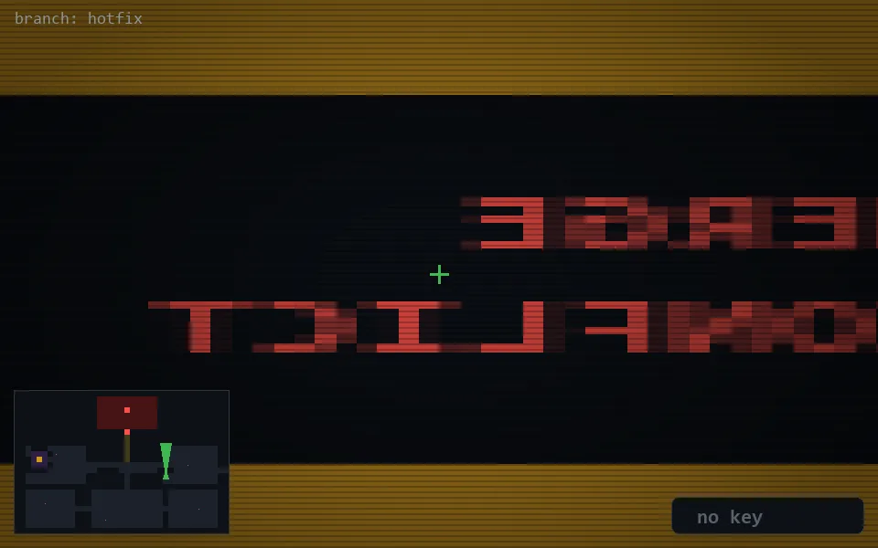

<!-- node:x27y15Nd -->
### `branch: hotfix` · 📍 (27, 15) · facing N · 🔑 — · ✖ bug deleted (it will be back)

|      |      |      |
|:----:|:----:|:----:|
|      | ⛔️ |      |
| [⬅️](x27y15Wd.md) | [💥](x27y15Nd.md) | [➡️](x27y15Ed.md) |
|      | [⬇️](x27y16Nd.md) |      |

[⌂ index](../README.md)
