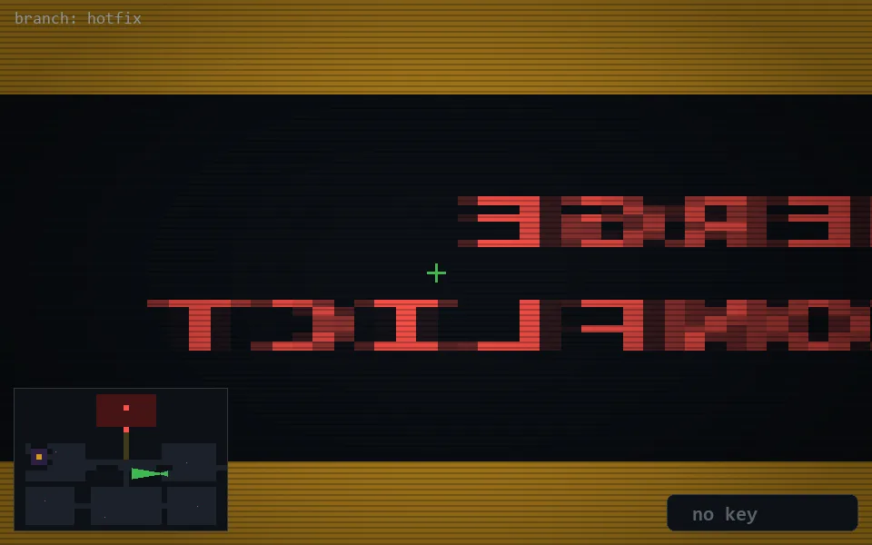

<!-- node:x27y15W -->
### `branch: hotfix` · 📍 (27, 15) · facing W · 🔑 —

|      |      |      |
|:----:|:----:|:----:|
|      | ⛔️ |      |
| [⬅️](x27y15S.md) | [💥](x27y15W.md) | [➡️](x27y15N.md) |
|      | [⬇️](x28y15W.md) |      |

[⌂ index](../README.md)
