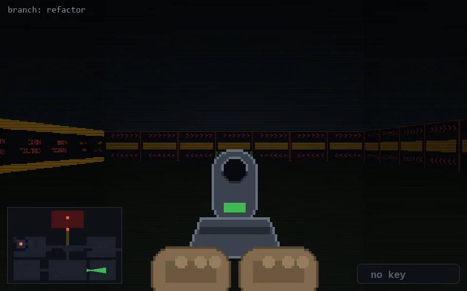

<!-- node:x27y21Ed -->
### `branch: refactor` · 📍 (27, 21) · facing E · 🔑 — · ✖ bug deleted (it will be back)

|      |      |      |
|:----:|:----:|:----:|
|      | [⬆️](x28y21Ed.md) |      |
| [⬅️](x27y21Nd.md) | [💥](x27y21Ed.md) | [➡️](x27y21Sd.md) |
|      | [⬇️](x26y21E.md) |      |

[⌂ index](../README.md)
