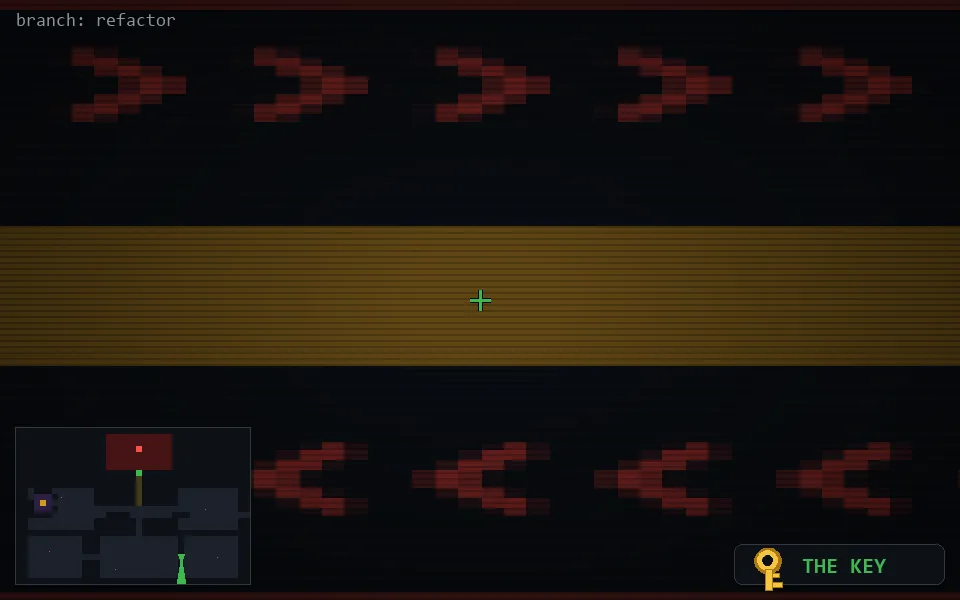

<!-- node:x27y21Sk -->
### `branch: refactor` · 📍 (27, 21) · facing S · 🔑 LGTM

|      |      |      |
|:----:|:----:|:----:|
|      | ⛔️ |      |
| [⬅️](x27y21Ek.md) | [💥](x27y21Sk.md) | [➡️](x27y21Wk.md) |
|      | ⛔️ |      |

[⌂ index](../README.md)
