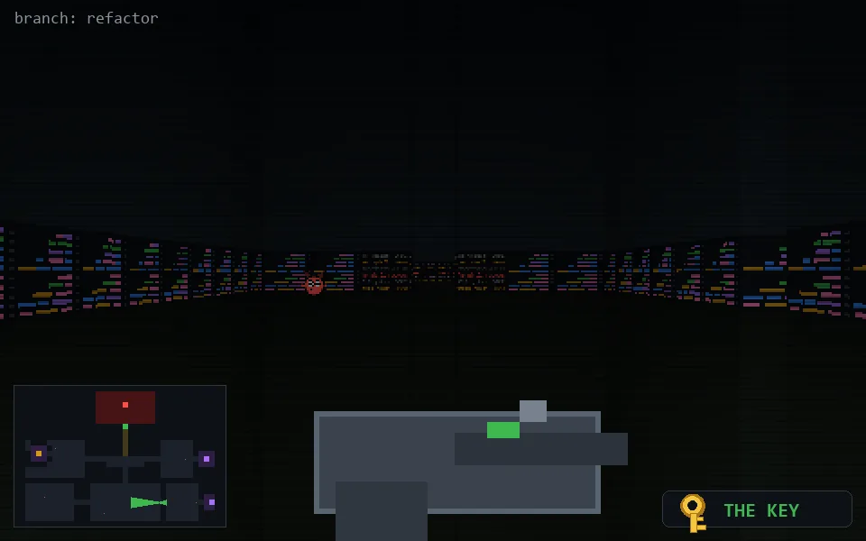

<!-- node:x27y21Wk -->
### `branch: refactor` · 📍 (27, 21) · facing W · 🔑 LGTM

|      |      |      |
|:----:|:----:|:----:|
|      | [⬆️](x26y21Wk.md) |      |
| [⬅️](x27y21Sk.md) | [💥](x27y21Wk.md) | [➡️](x27y21Nk.md) |
|      | [⬇️](x28y21Wk.md) |      |

[⌂ index](../README.md)
