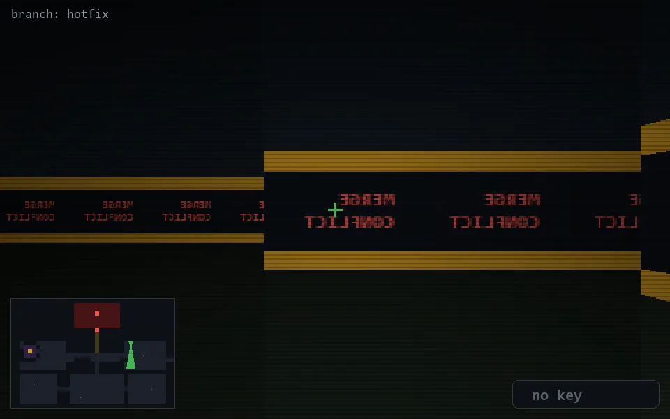

<!-- node:x28y10Sd -->
### `branch: hotfix` · 📍 (28, 10) · facing S · 🔑 — · ✖ bug deleted (it will be back)

|      |      |      |
|:----:|:----:|:----:|
|      | [⬆️](x28y11Sd.md) |      |
| [⬅️](x28y10Ed.md) | [💥](x28y10Sd.md) | [➡️](x28y10Wd.md) |
|      | ⛔️ |      |

[⌂ index](../README.md)
