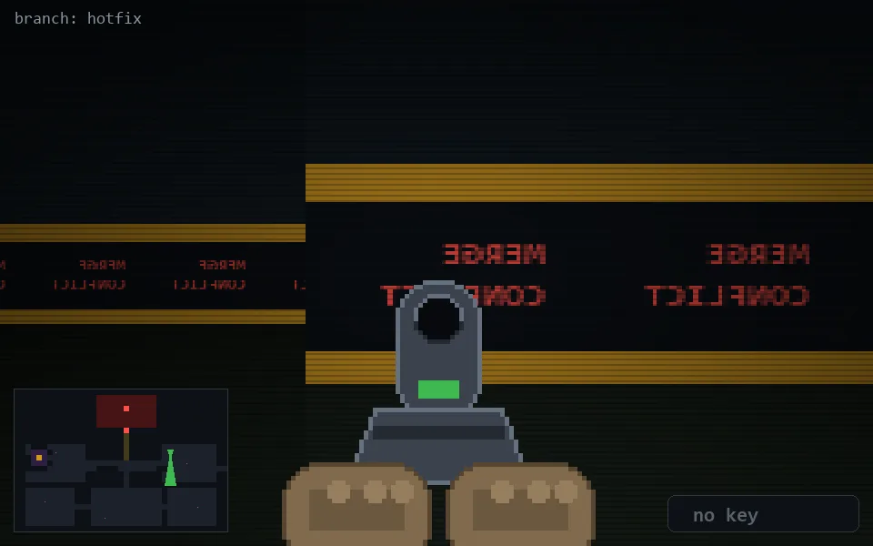

<!-- node:x28y11Sd -->
### `branch: hotfix` · 📍 (28, 11) · facing S · 🔑 — · ✖ bug deleted (it will be back)

|      |      |      |
|:----:|:----:|:----:|
|      | [⬆️](x28y12Sd.md) |      |
| [⬅️](x28y11Ed.md) | [💥](x28y11Sd.md) | [➡️](x28y11Wd.md) |
|      | [⬇️](x28y10Sd.md) |      |

[⌂ index](../README.md)
