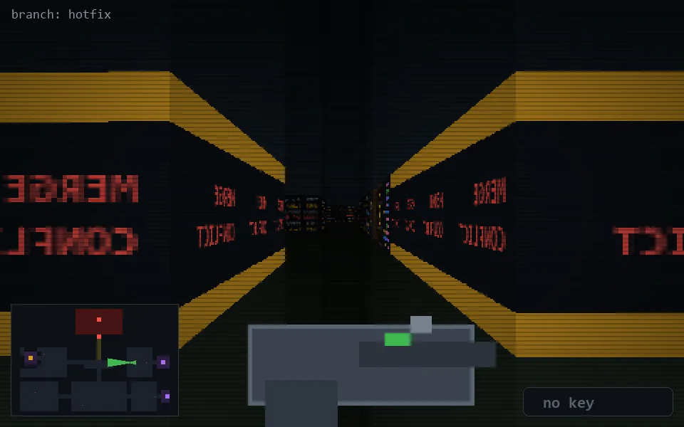

<!-- node:x28y13W -->
### `branch: hotfix` · 📍 (28, 13) · facing W · 🔑 —

|      |      |      |
|:----:|:----:|:----:|
|      | [⬆️](x27y13W.md) |      |
| [⬅️](x28y13S.md) | [💥](x28y13W.md) | [➡️](x28y13N.md) |
|      | [⬇️](x29y13W.md) |      |

[⌂ index](../README.md)
