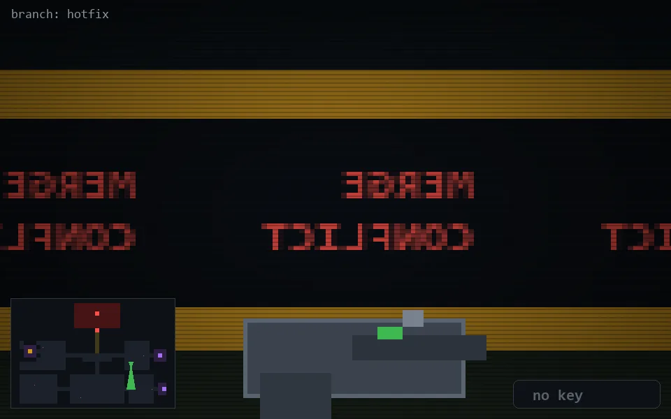

<!-- node:x28y15S -->
### `branch: hotfix` · 📍 (28, 15) · facing S · 🔑 —

|      |      |      |
|:----:|:----:|:----:|
|      | [⬆️](x28y16S.md) |      |
| [⬅️](x28y15E.md) | [💥](x28y15S.md) | [➡️](x28y15W.md) |
|      | ⛔️ |      |

[⌂ index](../README.md)
