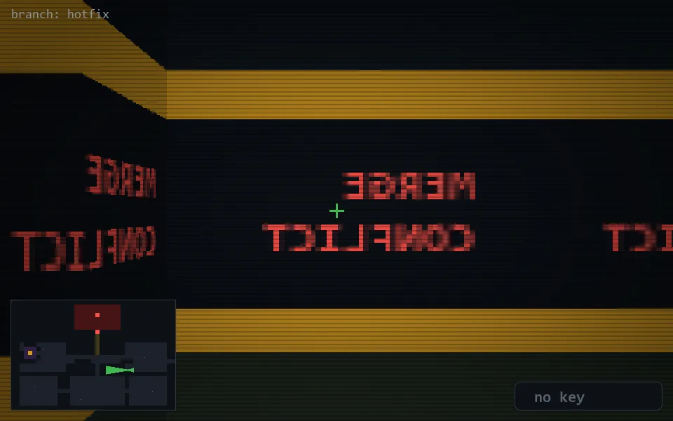

<!-- node:x28y16W -->
### `branch: hotfix` · 📍 (28, 16) · facing W · 🔑 —

|      |      |      |
|:----:|:----:|:----:|
|      | [⬆️](x27y16W.md) |      |
| [⬅️](x28y16S.md) | [💥](x28y16Wd.md) | [➡️](x28y16N.md) |
|      | [⬇️](x29y16W.md) |      |

[⌂ index](../README.md)
