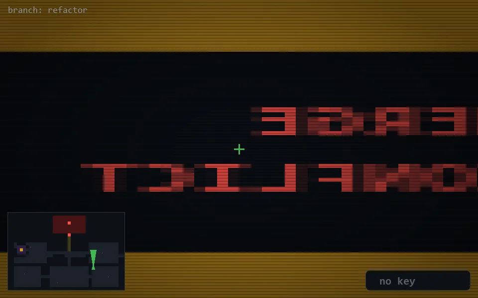

<!-- node:x28y18N -->
### `branch: refactor` · 📍 (28, 18) · facing N · 🔑 —

|      |      |      |
|:----:|:----:|:----:|
|      | ⛔️ |      |
| [⬅️](x28y18W.md) | [💥](x28y18N.md) | [➡️](x28y18E.md) |
|      | [⬇️](x28y19N.md) |      |

[⌂ index](../README.md)
