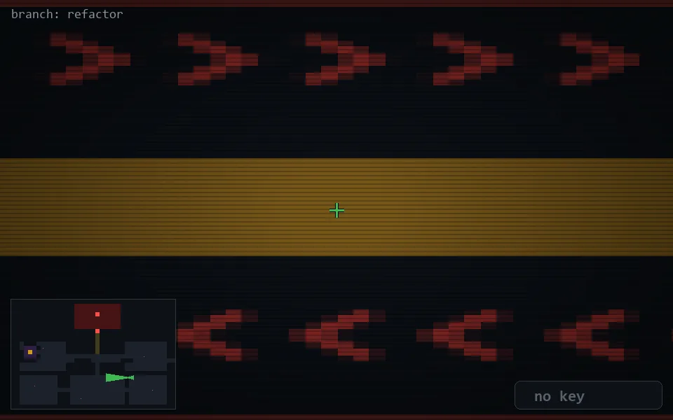

<!-- node:x28y18Wd -->
### `branch: refactor` · 📍 (28, 18) · facing W · 🔑 — · ✖ bug deleted (it will be back)

|      |      |      |
|:----:|:----:|:----:|
|      | ⛔️ |      |
| [⬅️](x28y18Sd.md) | [💥](x28y18Wd.md) | [➡️](x28y18Nd.md) |
|      | [⬇️](x29y18Wd.md) |      |

[⌂ index](../README.md)
