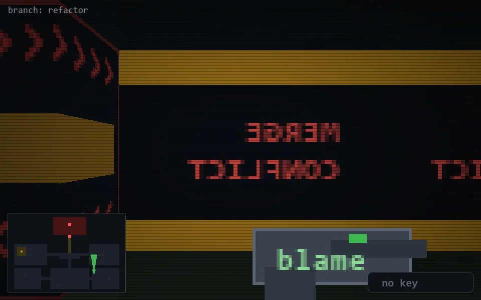

<!-- node:x28y19N -->
### `branch: refactor` · 📍 (28, 19) · facing N · 🔑 —

|      |      |      |
|:----:|:----:|:----:|
|      | [⬆️](x28y18N.md) |      |
| [⬅️](x28y19W.md) | [💥](x28y19N.md) | [➡️](x28y19E.md) |
|      | [⬇️](x28y20N.md) |      |

[⌂ index](../README.md)
