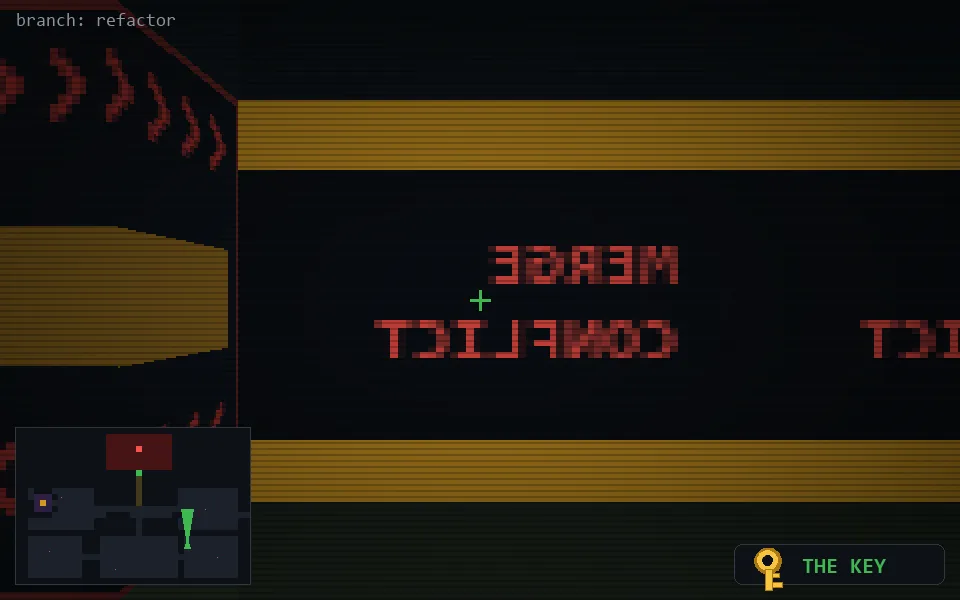

<!-- node:x28y19Nkd -->
### `branch: refactor` · 📍 (28, 19) · facing N · 🔑 THE KEY · ✖ bug deleted (it will be back)

|      |      |      |
|:----:|:----:|:----:|
|      | [⬆️](x28y18Nkd.md) |      |
| [⬅️](x28y19Wkd.md) | [💥](x28y19Nkd.md) | [➡️](x28y19Ekd.md) |
|      | [⬇️](x28y20Nkd.md) |      |

[⌂ index](../README.md)
