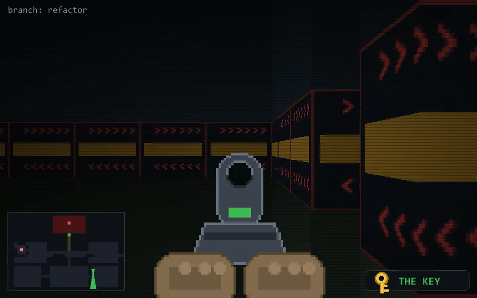

<!-- node:x28y19Skd -->
### `branch: refactor` · 📍 (28, 19) · facing S · 🔑 THE KEY · ✖ bug deleted (it will be back)

|      |      |      |
|:----:|:----:|:----:|
|      | [⬆️](x28y20Skd.md) |      |
| [⬅️](x28y19Ekd.md) | [💥](x28y19Skd.md) | [➡️](x28y19Wkd.md) |
|      | [⬇️](x28y18Skd.md) |      |

[⌂ index](../README.md)
