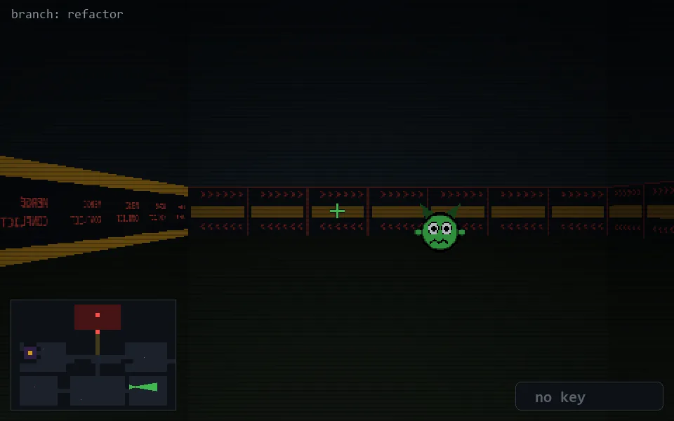

<!-- node:x28y20E -->
### `branch: refactor` · 📍 (28, 20) · facing E · 🔑 —

|      |      |      |
|:----:|:----:|:----:|
|      | [⬆️](x29y20E.md) |      |
| [⬅️](x28y20N.md) | [💥](x28y20Ed.md) | [➡️](x28y20S.md) |
|      | ⛔️ |      |

[⌂ index](../README.md)
