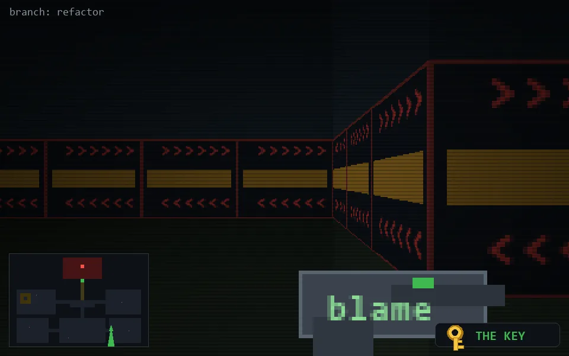

<!-- node:x28y20Sk -->
### `branch: refactor` · 📍 (28, 20) · facing S · 🔑 THE KEY

|      |      |      |
|:----:|:----:|:----:|
|      | [⬆️](x28y21Sk.md) |      |
| [⬅️](x28y20Ek.md) | [💥](x28y20Skd.md) | [➡️](x28y20Wk.md) |
|      | [⬇️](x28y19Sk.md) |      |

[⌂ index](../README.md)
