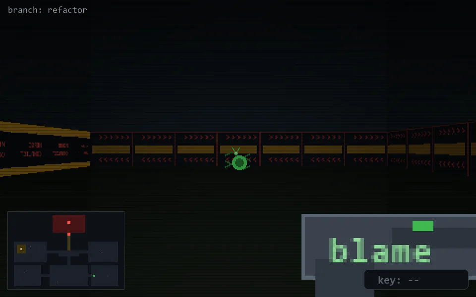

<!-- node:x28y21E -->
### `branch: refactor` · 📍 (28, 21) · facing E · 🔑 —

|      |      |      |
|:----:|:----:|:----:|
|      | [⬆️](x29y21E.md) |      |
| [⬅️](x28y21N.md) | [💥](x28y21Ed.md) | [➡️](x28y21S.md) |
|      | [⬇️](x27y21E.md) |      |

[⌂ index](../README.md)
