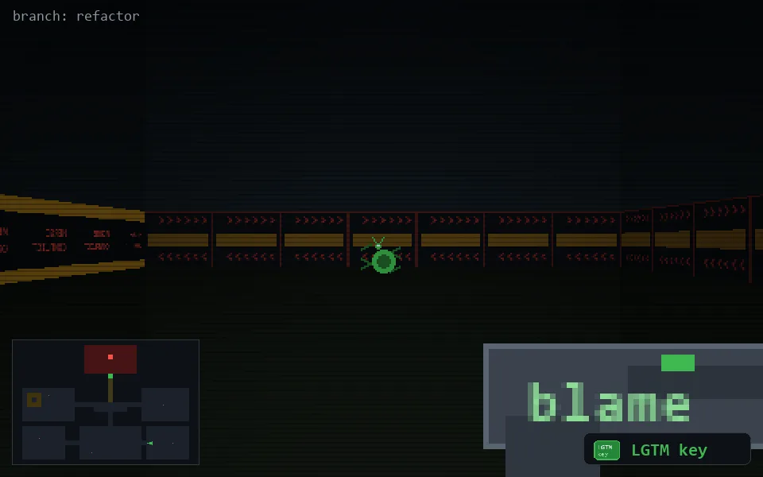

<!-- node:x28y21Ek -->
### `branch: refactor` · 📍 (28, 21) · facing E · 🔑 THE KEY

|      |      |      |
|:----:|:----:|:----:|
|      | [⬆️](x29y21Ek.md) |      |
| [⬅️](x28y21Nk.md) | [💥](x28y21Ekd.md) | [➡️](x28y21Sk.md) |
|      | [⬇️](x27y21Ek.md) |      |

[⌂ index](../README.md)
