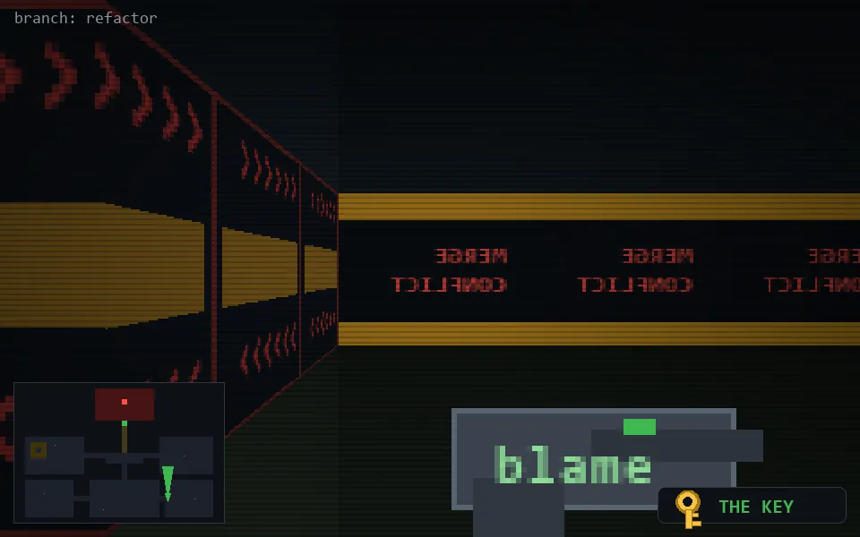

<!-- node:x28y21Nk -->
### `branch: refactor` · 📍 (28, 21) · facing N · 🔑 THE KEY

|      |      |      |
|:----:|:----:|:----:|
|      | [⬆️](x28y20Nk.md) |      |
| [⬅️](x28y21Wk.md) | [💥](x28y21Nkd.md) | [➡️](x28y21Ek.md) |
|      | [⬇️](x28y22Nk.md) |      |

[⌂ index](../README.md)
