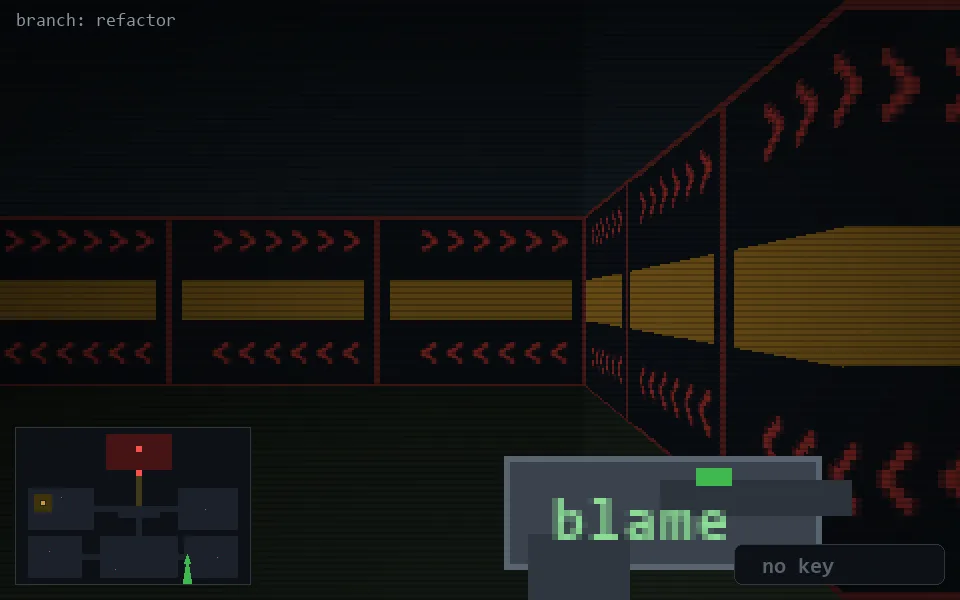

<!-- node:x28y21S -->
### `branch: refactor` · 📍 (28, 21) · facing S · 🔑 —

|      |      |      |
|:----:|:----:|:----:|
|      | [⬆️](x28y22S.md) |      |
| [⬅️](x28y21E.md) | [💥](x28y21S.md) | [➡️](x28y21W.md) |
|      | [⬇️](x28y20S.md) |      |

[⌂ index](../README.md)
