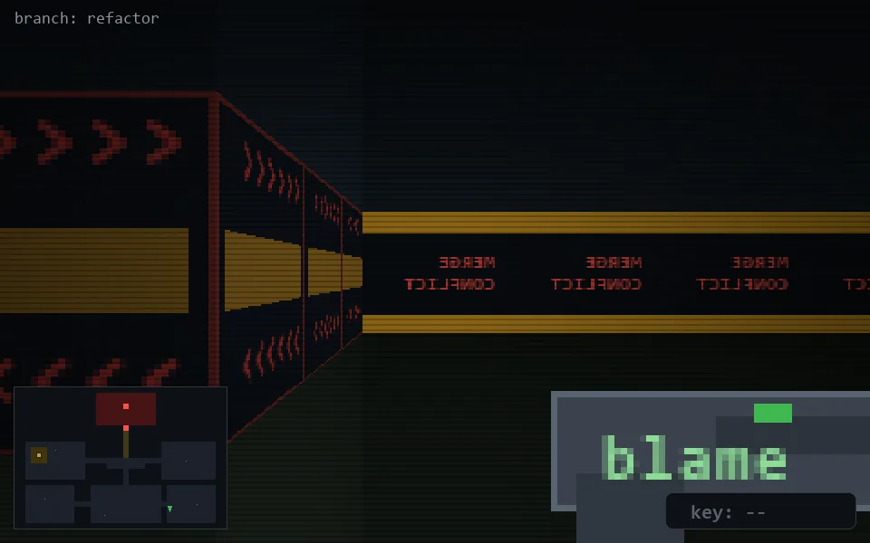

<!-- node:x28y22N -->
### `branch: refactor` · 📍 (28, 22) · facing N · 🔑 —

|      |      |      |
|:----:|:----:|:----:|
|      | [⬆️](x28y21N.md) |      |
| [⬅️](x28y22W.md) | [💥](x28y22N.md) | [➡️](x28y22E.md) |
|      | [⬇️](x28y23N.md) |      |

[⌂ index](../README.md)
