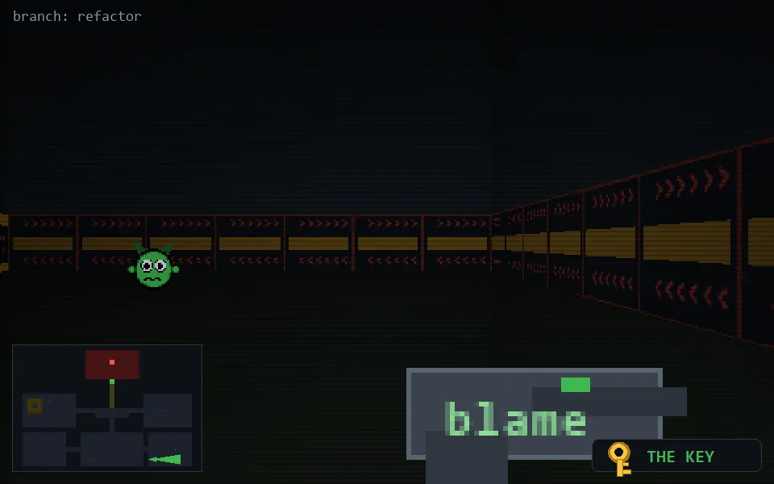

<!-- node:x28y23Ek -->
### `branch: refactor` · 📍 (28, 23) · facing E · 🔑 THE KEY

|      |      |      |
|:----:|:----:|:----:|
|      | [⬆️](x29y23Ek.md) |      |
| [⬅️](x28y23Nk.md) | [💥](x28y23Ek.md) | [➡️](x28y23Sk.md) |
|      | ⛔️ |      |

[⌂ index](../README.md)
