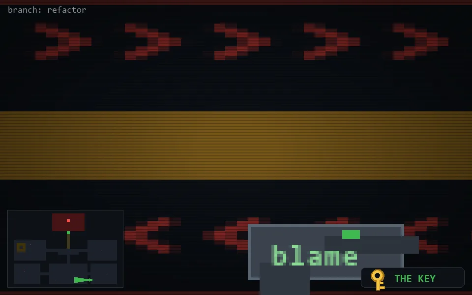

<!-- node:x28y23Wk -->
### `branch: refactor` · 📍 (28, 23) · facing W · 🔑 LGTM

|      |      |      |
|:----:|:----:|:----:|
|      | ⛔️ |      |
| [⬅️](x28y23Sk.md) | [💥](x28y23Wk.md) | [➡️](x28y23Nk.md) |
|      | [⬇️](x29y23Wk.md) |      |

[⌂ index](../README.md)
