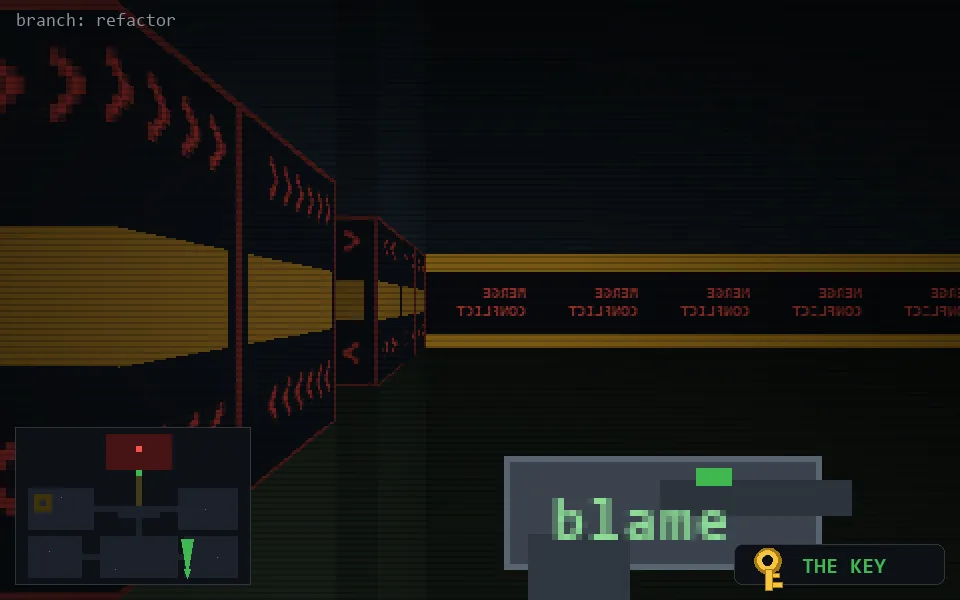

<!-- node:x28y24Nk -->
### `branch: refactor` · 📍 (28, 24) · facing N · 🔑 LGTM

|      |      |      |
|:----:|:----:|:----:|
|      | [⬆️](x28y23Nk.md) |      |
| [⬅️](x28y24Wk.md) | [💥](x28y24Nk.md) | [➡️](x28y24Ek.md) |
|      | ⛔️ |      |

[⌂ index](../README.md)
