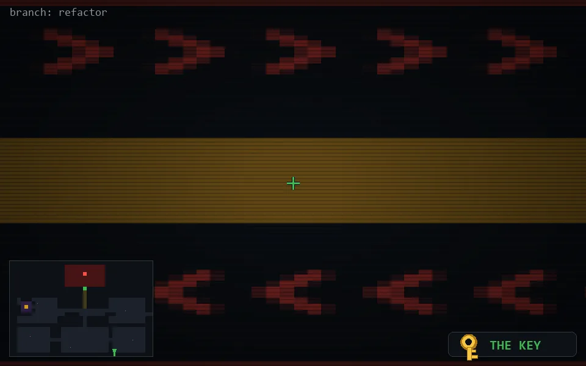

<!-- node:x28y24Sk -->
### `branch: refactor` · 📍 (28, 24) · facing S · 🔑 THE KEY

|      |      |      |
|:----:|:----:|:----:|
|      | ⛔️ |      |
| [⬅️](x28y24Ek.md) | [💥](x28y24Skd.md) | [➡️](x28y24Wk.md) |
|      | [⬇️](x28y23Sk.md) |      |

[⌂ index](../README.md)
