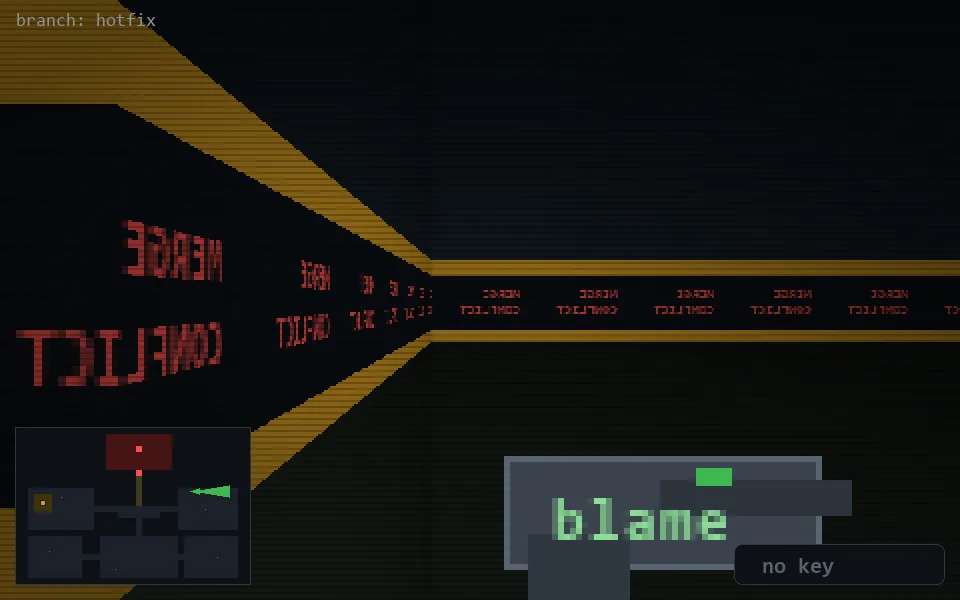

<!-- node:x29y10E -->
### `branch: hotfix` · 📍 (29, 10) · facing E · 🔑 —

|      |      |      |
|:----:|:----:|:----:|
|      | [⬆️](x30y10E.md) |      |
| [⬅️](x29y10N.md) | [💥](x29y10Ed.md) | [➡️](x29y10S.md) |
|      | [⬇️](x28y10E.md) |      |

[⌂ index](../README.md)
