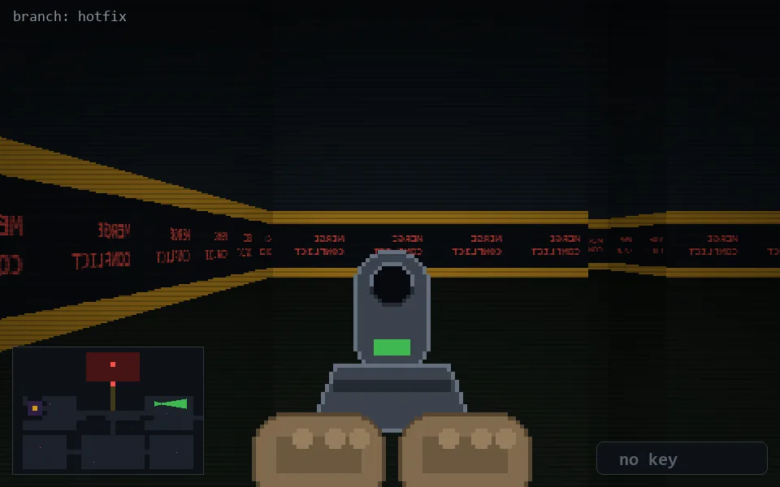

<!-- node:x29y11Ed -->
### `branch: hotfix` · 📍 (29, 11) · facing E · 🔑 — · ✖ bug deleted (it will be back)

|      |      |      |
|:----:|:----:|:----:|
|      | [⬆️](x30y11Ed.md) |      |
| [⬅️](x29y11Nd.md) | [💥](x29y11Ed.md) | [➡️](x29y11Sd.md) |
|      | [⬇️](x28y11Ed.md) |      |

[⌂ index](../README.md)
