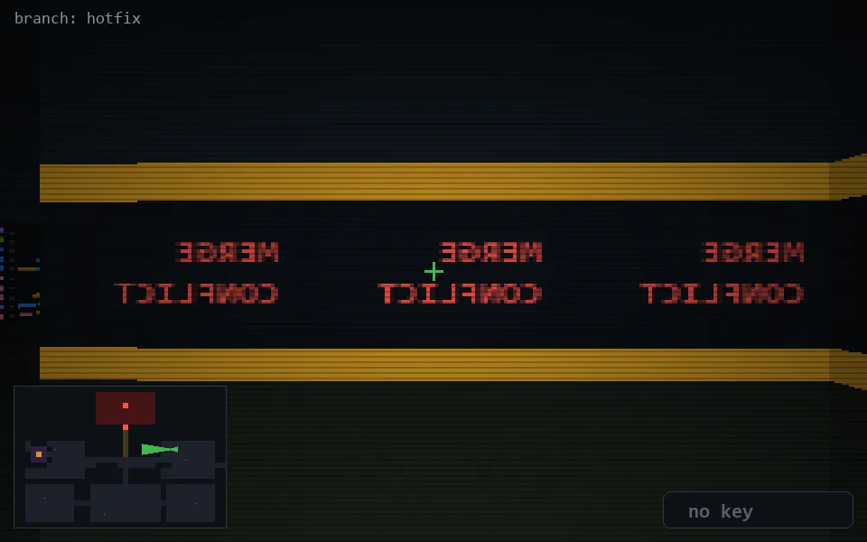

<!-- node:x29y11W -->
### `branch: hotfix` · 📍 (29, 11) · facing W · 🔑 —

|      |      |      |
|:----:|:----:|:----:|
|      | [⬆️](x28y11W.md) |      |
| [⬅️](x29y11S.md) | [💥](x29y11Wd.md) | [➡️](x29y11N.md) |
|      | [⬇️](x30y11W.md) |      |

[⌂ index](../README.md)
