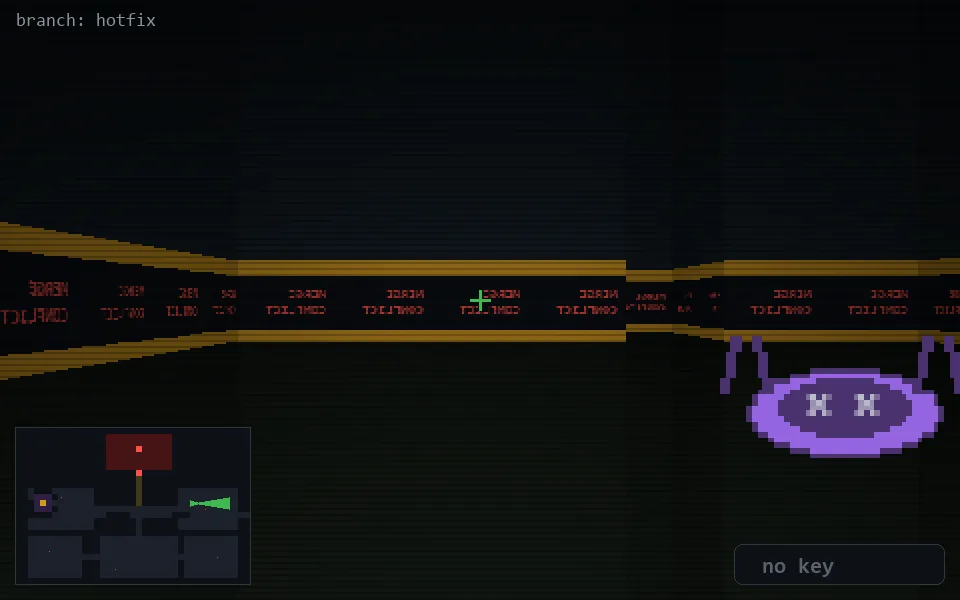

<!-- node:x29y12Ed -->
### `branch: hotfix` · 📍 (29, 12) · facing E · 🔑 — · ✖ bug deleted (it will be back)

|      |      |      |
|:----:|:----:|:----:|
|      | [⬆️](x30y12Ed.md) |      |
| [⬅️](x29y12Nd.md) | [💥](x29y12Ed.md) | [➡️](x29y12Sd.md) |
|      | [⬇️](x28y12Ed.md) |      |

[⌂ index](../README.md)
