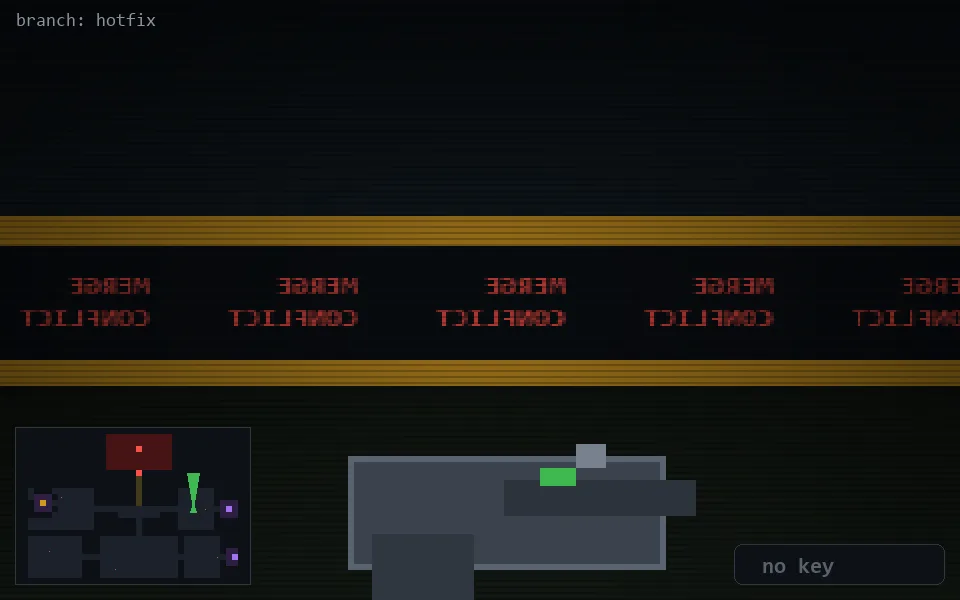

<!-- node:x29y13N -->
### `branch: hotfix` · 📍 (29, 13) · facing N · 🔑 —

|      |      |      |
|:----:|:----:|:----:|
|      | [⬆️](x29y12N.md) |      |
| [⬅️](x29y13W.md) | [💥](x29y13N.md) | [➡️](x29y13E.md) |
|      | [⬇️](x29y14N.md) |      |

[⌂ index](../README.md)
