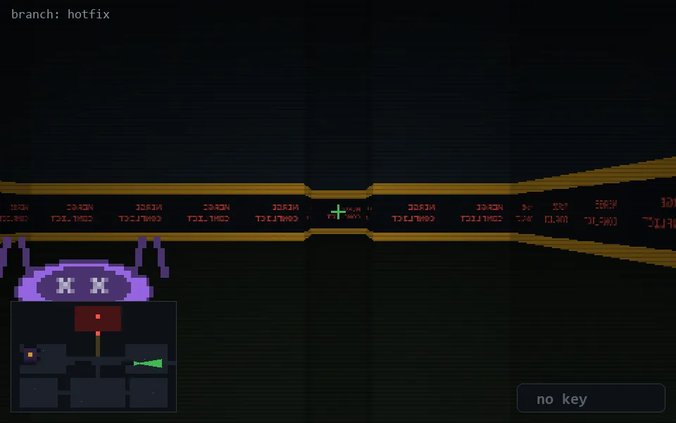

<!-- node:x29y14Ed -->
### `branch: hotfix` · 📍 (29, 14) · facing E · 🔑 — · ✖ bug deleted (it will be back)

|      |      |      |
|:----:|:----:|:----:|
|      | [⬆️](x30y14Ed.md) |      |
| [⬅️](x29y14Nd.md) | [💥](x29y14Ed.md) | [➡️](x29y14Sd.md) |
|      | ⛔️ |      |

[⌂ index](../README.md)
