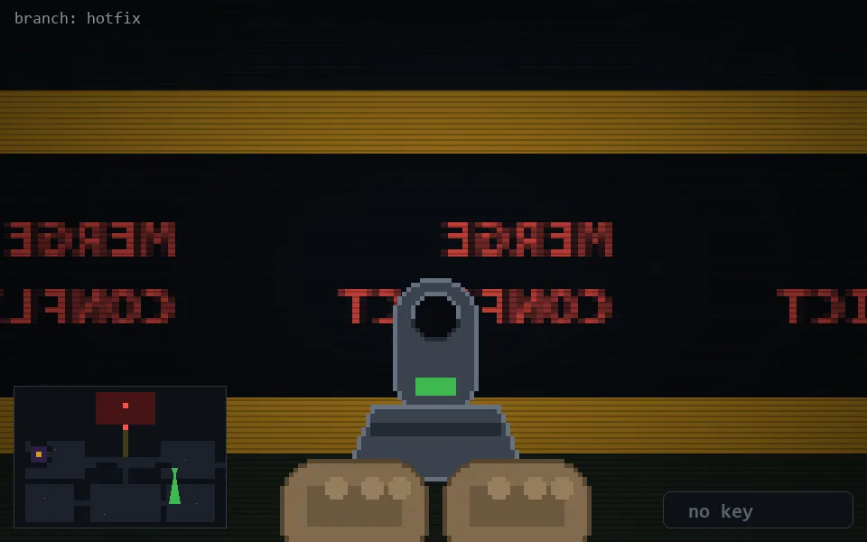

<!-- node:x29y15Sd -->
### `branch: hotfix` · 📍 (29, 15) · facing S · 🔑 — · ✖ bug deleted (it will be back)

|      |      |      |
|:----:|:----:|:----:|
|      | [⬆️](x29y16Sd.md) |      |
| [⬅️](x29y15Ed.md) | [💥](x29y15Sd.md) | [➡️](x29y15Wd.md) |
|      | [⬇️](x29y14Sd.md) |      |

[⌂ index](../README.md)
