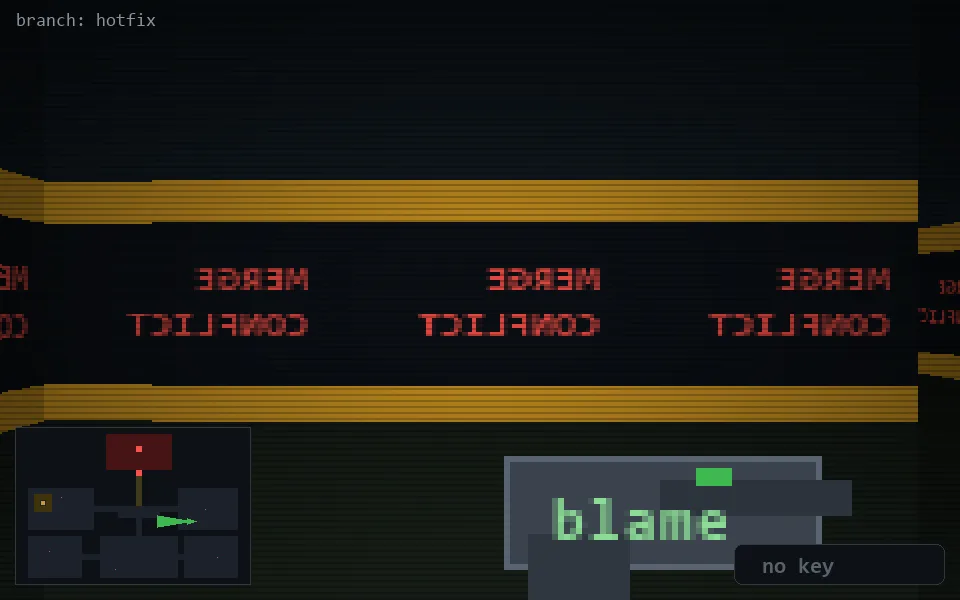

<!-- node:x29y15W -->
### `branch: hotfix` · 📍 (29, 15) · facing W · 🔑 —

|      |      |      |
|:----:|:----:|:----:|
|      | [⬆️](x28y15W.md) |      |
| [⬅️](x29y15S.md) | [💥](x29y15W.md) | [➡️](x29y15N.md) |
|      | [⬇️](x30y15W.md) |      |

[⌂ index](../README.md)
