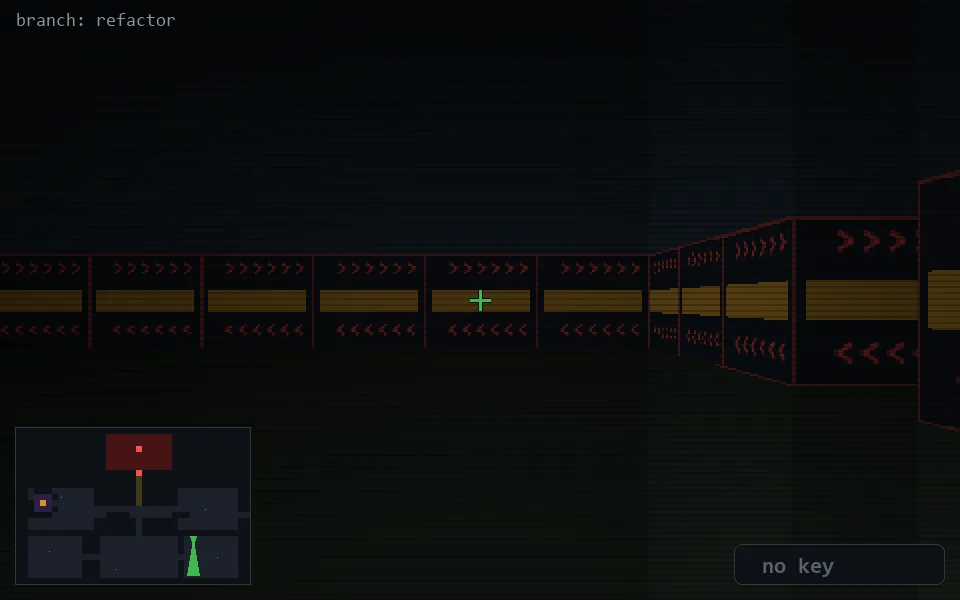

<!-- node:x29y18S -->
### `branch: refactor` · 📍 (29, 18) · facing S · 🔑 —

|      |      |      |
|:----:|:----:|:----:|
|      | [⬆️](x29y19S.md) |      |
| [⬅️](x29y18E.md) | [💥](x29y18Sd.md) | [➡️](x29y18W.md) |
|      | ⛔️ |      |

[⌂ index](../README.md)
