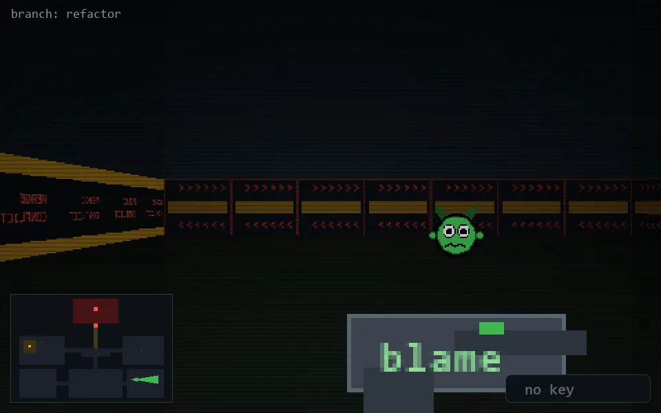

<!-- node:x29y20E -->
### `branch: refactor` · 📍 (29, 20) · facing E · 🔑 —

|      |      |      |
|:----:|:----:|:----:|
|      | [⬆️](x30y20E.md) |      |
| [⬅️](x29y20N.md) | [💥](x29y20Ed.md) | [➡️](x29y20S.md) |
|      | [⬇️](x28y20E.md) |      |

[⌂ index](../README.md)
