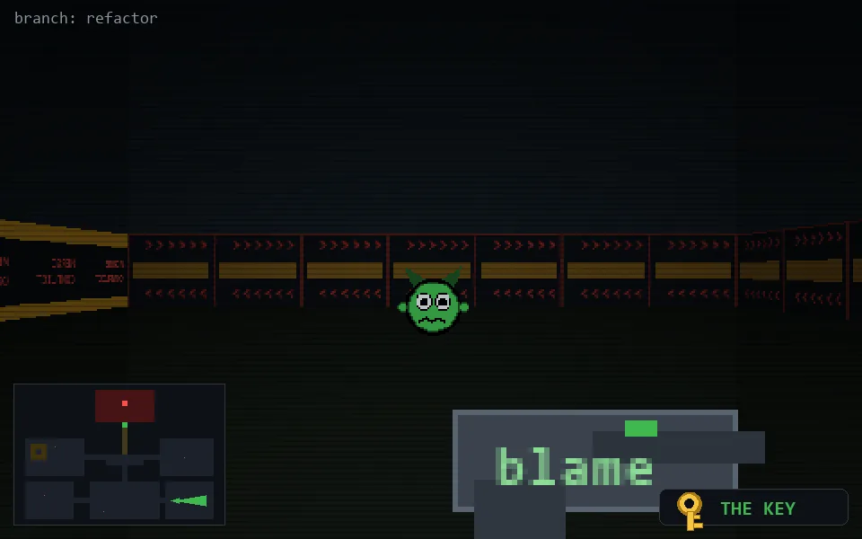

<!-- node:x29y21Ek -->
### `branch: refactor` · 📍 (29, 21) · facing E · 🔑 LGTM

|      |      |      |
|:----:|:----:|:----:|
|      | [⬆️](x30y21Ek.md) |      |
| [⬅️](x29y21Nk.md) | [💥](x29y21Ek.md) | [➡️](x29y21Sk.md) |
|      | [⬇️](x28y21Ek.md) |      |

[⌂ index](../README.md)
