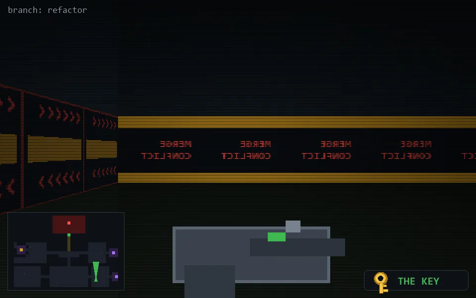

<!-- node:x29y22Nk -->
### `branch: refactor` · 📍 (29, 22) · facing N · 🔑 THE KEY

|      |      |      |
|:----:|:----:|:----:|
|      | [⬆️](x29y21Nk.md) |      |
| [⬅️](x29y22Wk.md) | [💥](x29y22Nkd.md) | [➡️](x29y22Ek.md) |
|      | [⬇️](x29y23Nk.md) |      |

[⌂ index](../README.md)
